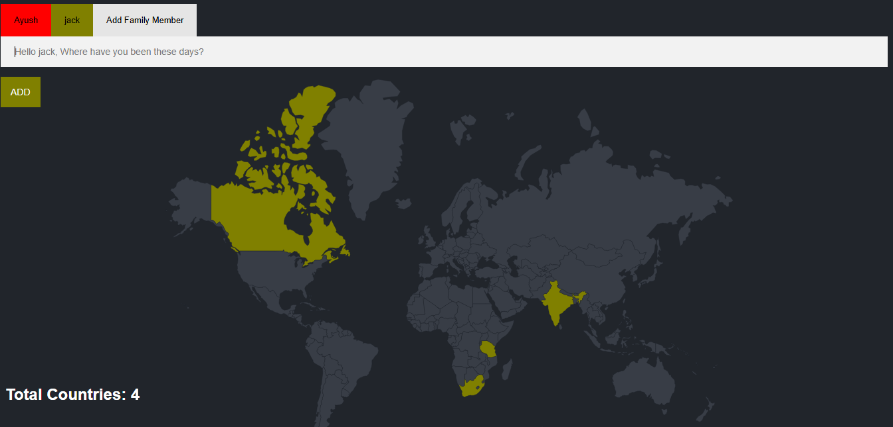
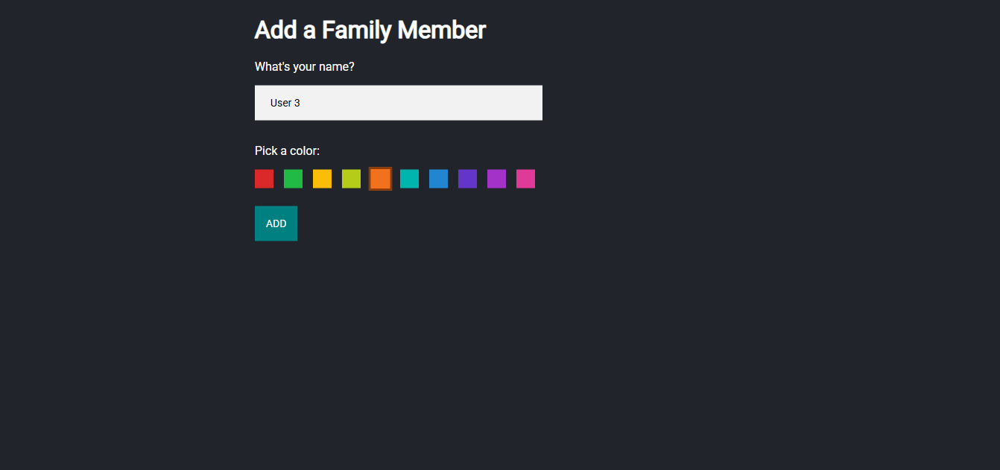

# 🌍 Family Travel Tracker

A beautifully designed web app to track countries visited by family members. Each user selects a unique color, and whenever they type a country's name, it gets highlighted on the world map in their chosen color.
<br><br>

<br><br>


---

## 📦 How to Run Locally

**Clone the repository**

```bash
git clone https://github.com/ayushverma2909/Family-Travel-tracker.git
cd Family-Travel-tracker
npm install
nodemon index.js
```
---
## **DataBase**
- **Make sure to change your database and password inside (index.js).**


- ->  database: "your database name",
- ->  password: "Your postgres password",


---
## 🛠 Tech Stack

- **Backend**: Node.js, Express.js
- **Frontend**: EJS, CSS, JavaScript
- **Database**: PostgreSQL
- **Map Visualization**: JavaScript + Custom Styling

---

## 🚀 Features

- Users can type and add visited country names.
- Each user selects a unique color once for map highlights.
- All countries visited by a user are marked on the map in their chosen color.
- Travel history is saved in a PostgreSQL database.

---

